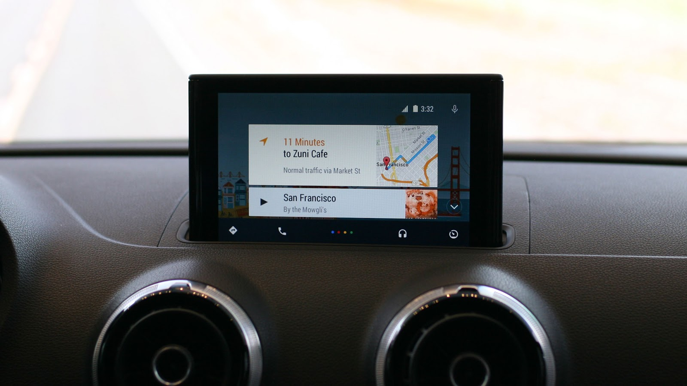
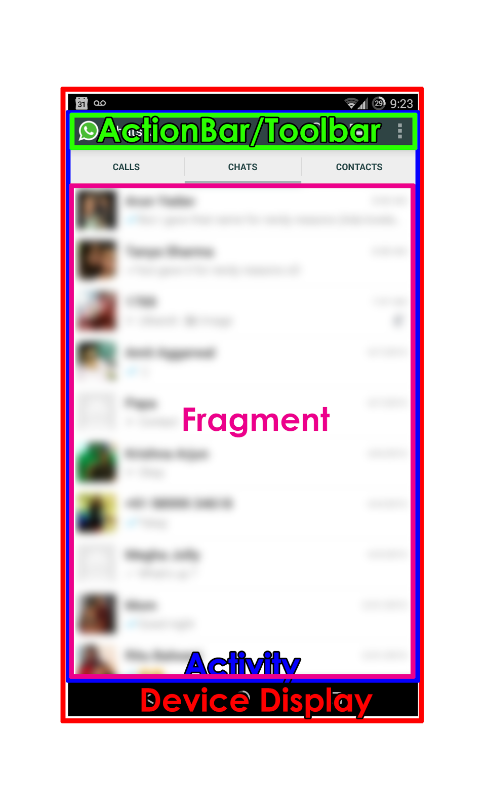

# Intro To Android Programming

## Intro

### What is Android?
Android is a Linux Kernel based operating system developed by Google. 
It originally started as a mobile OS, but has now expanded to :

#### Android TV

#### Android Wear

#### Android Auto

### Why Android?

* Thousands of Unique devices supported
* Written in Java 
* Amazing IDE
* Play store is more lax.
* Well documented 

### Getting Started

* ##Download Android Studio + SDK
    - https://developer.android.com/sdk/index.html
    - Or you can get it from me in a flash drive! 
* ##Understanding Android 
    - Read the documentation and understand the structure
    - Ask Questions, we're here for that :)

### Resources

* Android Developer Guides : https://developer.android.com/guide/index.html
* Android Developer Training : https://developer.android.com/training/index.html
* Tutorials on various topics : http://www.androidhive.info/
* Google is your friend! :D
* Stackoverflow is God!

### Basic Structure of an App

### What do these words mean?

* Activity
    - Activities are the basic building blocks of your 
    - Each screen in your app would be an activity
* Actionbar/Toolbar
    - The toolbar at the top is known as the ActionBar (Renamed to Toolbar in Lollipop)
    - It is optional, but useful
    - Usually contains frequently needed actions and options menu
* Fragment
    - Fragments are subsets of activities
    - Multiple fragments in one activity
    - Can be moved around to create Tabbed Layouts or NavDrawer Layouts

### Lets start the tutorial

So, today we’ll be making an app called clickzilla which introduces you to making a basic activity, layout and using intents and also using the options menu.
Here’s the completed code for this project for reference
https://github.com/adibalwani03/ClickZilla
